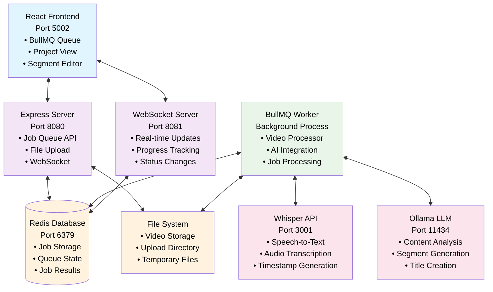

# VideoSplice AI System Architecture

## Overview

VideoSplice AI is a distributed video processing system that uses AI to automatically segment videos into logical sections. The system leverages BullMQ for job queue management, local AI models for transcription and analysis, and a React frontend for user interaction.

## Architecture Diagram



## Data Flow

### 1. Video Upload Process

```
User Browser → Frontend Upload → Express Server → File Storage → BullMQ Queue → Real-time Updates
```

**Steps:**
1. **User Upload**: User selects video file in React frontend (`UploadZone.tsx`)
2. **File Transfer**: File is uploaded to Express server via multipart/form-data (`POST /api/upload`)
3. **File Storage**: Server stores file in `/uploads` directory with unique UUID filename
4. **Job Creation**: Server creates BullMQ job with video metadata and LLM settings
5. **Queue Submission**: Job is queued for processing with priority based on file size
6. **Frontend Response**: Frontend receives job ID and begins real-time polling for updates
7. **UI Update**: Frontend displays job card with "Queued" status and progress tracking

### 2. Video Processing Pipeline

```
BullMQ Job → Worker Pickup → Transcription → AI Analysis → Segmentation → Result Storage → Frontend Update
```

**Detailed Flow:**

#### Phase 1: Job Initialization (0-10%)
- **Worker Pickup**: BullMQ worker (`videoProcessor.ts`) picks up job from Redis queue
- **Validation**: Worker validates video file exists in uploads directory
- **Progress Update**: Sends initial progress update via WebSocket to frontend
- **Status**: Frontend shows "Starting video processing..." with 0% progress

#### Phase 2: Audio Transcription (10-50%)
- **Audio Extraction**: Worker extracts audio from video using FFmpeg
- **Whisper API Call**: Sends audio to local Whisper server (localhost:3001)
- **Transcript Generation**: Receives detailed transcript with word-level timestamps (29 segments for ~2.5min video)
- **Progress Update**: Updates job progress to 50% via WebSocket
- **Status**: Frontend shows "Transcribing audio..." → "Transcription completed"

#### Phase 3: AI Content Analysis (50-90%)
- **LLM Prompt**: Creates structured prompt with full transcript and whisper segment timing data
- **Ollama API Call**: Sends analysis request to local Ollama LLM (localhost:11434, qwen2.5:7b model)
- **Segment Generation**: LLM analyzes content and generates 4-8 logical segments with titles/descriptions
- **Timing Mapping**: Maps LLM segments to actual whisper segment boundaries for precise timing
- **Validation**: Validates segment timing, removes zero-duration segments, fixes overlaps
- **Progress Update**: Updates job progress to 90% via WebSocket
- **Status**: Frontend shows "Analyzing content with LLM..." with animated purple badge

#### Phase 4: Result Finalization (90-100%)
- **Result Assembly**: Combines transcript, segments, duration, and metadata into complete result object
- **BullMQ Storage**: Stores complete results in `job.returnvalue` field in Redis
- **Progress Completion**: Updates job progress to 100% via WebSocket
- **Cleanup**: Removes uploaded video file from server storage
- **Status**: Frontend shows "Video processing completed" with green checkmark

### 3. Real-time Updates & Frontend Integration

```
Worker Progress → WebSocket Server → WebSocket Client → Frontend State Update → UI Refresh
```

**Update Types & Frontend Response:**

#### Progress Updates
- **Progress Values**: 0% → 10% → 50% → 60% → 90% → 100%
- **Frontend Response**: Animated progress bars with blue fill and percentage display
- **UI Elements**: Full-width progress bars replace individual status badges

#### Status Transitions  
- **Queued**: Gray badge, file upload confirmation
- **Processing (0-10%)**: Blue badge "Starting video processing..."
- **Transcribing (10-50%)**: Blue badge "Transcribing audio..." with animated dots
- **Analyzing (50-90%)**: Purple badge "LLM analyzing content for segments..." with bouncing animation
- **Completed (100%)**: Green badge "Video processing completed" with checkmark
- **Failed**: Red badge with error message and retry option

#### WebSocket Integration
- **Connection**: Frontend establishes WebSocket connection on app load
- **Job Subscription**: Subscribes to updates for active job IDs
- **State Management**: Updates React state triggering UI re-renders
- **Error Handling**: Graceful degradation with polling fallback if WebSocket fails

### 4. Results Retrieval & Project Creation

```
Job Completion → API Polling → Result Display → Project Creation → Segment Editor
```

**Complete Flow:**

#### Job Completion Detection
1. **Worker Completion**: Worker stores complete results in `job.returnvalue` including:
   - Full transcript (2638 characters for sample video)
   - 7 intelligent segments with titles, descriptions, and precise timing
   - Video duration and metadata
   - LLM reasoning for segmentation decisions

2. **API Polling**: Frontend continuously polls `/api/jobs` endpoint
3. **Status Detection**: Frontend detects `finishedOn` timestamp and `returnvalue` presence
4. **UI Update**: "View Results" button appears with working functionality

#### Project Creation Flow
1. **User Action**: User clicks "View Results" button on completed job
2. **Data Retrieval**: Frontend extracts complete results from `job.returnvalue`
3. **Project Generation**: Creates new project object with:
   ```typescript
   {
     id: jobId,
     name: fileName,
     transcript: job.returnvalue.transcript,
     segments: job.returnvalue.segments, // 7 segments with timing
     duration: job.returnvalue.duration,
     videoUrl: constructVideoUrl(jobId)
   }
   ```
4. **Storage**: Saves project to localStorage for persistence
5. **Navigation**: Routes to ProjectView (`/project/${jobId}`)

#### Segment Editor Integration
1. **Project Load**: ProjectView loads project data and video
2. **Timeline Rendering**: Displays interactive timeline with segment boundaries
3. **Video Player**: Synced video player with segment navigation
4. **Editing Interface**: User can modify segment titles, descriptions, and boundaries
5. **Export Options**: Generate clips, timestamps, or export data

## Component Details

### Frontend Components (React)

#### Core Components
- **App.tsx**: Main application router and state management with error boundaries
- **BullMQQueue.tsx**: Job queue interface with:
  - Real-time WebSocket updates
  - Animated progress bars and status badges
  - Full-width progress tracking with descriptive status text
  - Enhanced debugging with Force View functionality
  - Unified job rendering with consistent UI patterns
- **ProjectView.tsx**: Project management and navigation with video integration
- **SegmentEditor.tsx**: Interactive video segment editing interface
- **UploadZone.tsx**: Drag-and-drop video upload with progress tracking

#### Data Flow Components
- **queueAPI.ts**: Comprehensive API client for BullMQ server communication
- **useLocalStorage.ts**: Persistent project storage with automatic caching
- **WebSocket Client**: Real-time job update subscription with reconnection logic
- **Custom Status Logic**: Enhanced job status determination beyond BullMQ internal states

### Backend Services (Express/Node.js)

#### API Endpoints
- `POST /api/upload`: Video file upload and job creation with metadata
- `GET /api/jobs`: List all jobs with complete status and `returnvalue` results
- `GET /api/jobs/:id`: Get specific job details with processing history
- `DELETE /api/jobs/:id`: Remove job from queue and cleanup files
- `GET /api/stats`: Queue statistics and system health metrics
- `POST /api/jobs/:id/cache`: Cache completed job data for extended retention

#### Core Services
- **queueService.ts**: BullMQ queue management with Redis persistence
- **websocketService.ts**: Real-time communication with connection management
- **videoProcessor.ts**: Complete job processing worker with:
  - Whisper API integration for transcription
  - Ollama LLM integration for intelligent segmentation
  - Comprehensive error handling and retry logic
  - File cleanup and resource management
  - Progress tracking and WebSocket notifications

#### Result Storage & Retrieval
- **BullMQ Integration**: Jobs store complete results in `job.returnvalue` field
- **Redis Persistence**: Results persist in Redis with configurable retention (50 jobs)
- **API Serialization**: Complete job objects with `returnvalue` served to frontend
- **Deduplication Logic**: Prevents duplicate jobs in API responses

### Worker Process (Background)

#### Processing Stages
1. **File Validation**: Verify video file exists and is readable
2. **Transcription Service**: Interface with Whisper API
3. **LLM Integration**: Content analysis with Ollama
4. **Segment Generation**: Create timed video segments
5. **Result Storage**: Store complete processing results

### External Dependencies

#### AI Services
- **Whisper Server** (Port 3001): Speech-to-text transcription
- **Ollama** (Port 11434): Local LLM for content analysis

#### Infrastructure
- **Redis** (Port 6379): Job queue persistence and state management
- **File System**: Video upload storage and temporary files

## Data Models

### Job Structure
```typescript
interface VideoJob {
  id: string                    // Unique job identifier (UUID)
  fileName: string              // Original video filename
  fileSize: number             // File size in bytes (e.g., 15854387)
  filePath: string             // Server file path (uploads/[uuid].mp4)
  status: JobStatus            // Current processing status
  createdAt: number            // Job creation timestamp
  updatedAt: number            // Last update timestamp
  llmSettings: LLMSettings     // AI model configuration
  customTranscript?: string    // Optional custom transcript
  hasCustomTranscript: boolean // Custom transcript flag
}
```

### Complete Job Result Structure (Stored in job.returnvalue)
```typescript
interface JobResult {
  jobId: string               // References original job (matches job.id)
  fileName: string            // Video filename (e.g., "RIOS Rhino Tools.mp4")
  duration: number           // Video duration in seconds (e.g., 153.26)
  transcript: string         // Full video transcript (e.g., 2638 characters)
  segments: VideoSegment[]   // Generated segments (typically 4-8 segments)
  segmentCount: number       // Total number of segments (e.g., 7)
  reasoning: string          // AI segmentation explanation
  completedAt: number        // Processing completion timestamp
}
```

### Actual Working Example
```typescript
// Real job result from working system:
{
  "jobId": "6943d821-e854-4a72-b437-de48d2a474a1",
  "fileName": "RIOS Rhino Tools - Grasshopper - Drainage Density Tool.mp4",
  "duration": 153.26,
  "transcript": "Hi. In this quick video, we'll talk about how to use...", // Full 2638 char transcript
  "segments": [
    {
      "id": "seg-1",
      "title": "Introduction and Overview of Drainage Density Tool",
      "description": "The video starts with a greeting...",
      "startTime": 0,
      "endTime": 28
    },
    // ... 6 more segments with intelligent titles and timing
  ],
  "segmentCount": 7,
  "reasoning": "These segments break down the video content into logical parts...",
  "completedAt": 1761374806562
}
```

### Video Segment Structure
```typescript
interface VideoSegment {
  id: string                 // Segment identifier
  title: string              // AI-generated title
  description: string        // AI-generated description
  startTime: number          // Start time in seconds
  endTime: number           // End time in seconds
}
```

### Project Structure
```typescript
interface Project {
  id: string                    // Project identifier
  name: string                  // Project display name
  jobId: string                 // Source job reference
  videoUrl?: string             // Video file URL
  transcript: string            // Full transcript
  segments: VideoSegment[]      // Editable segments
  duration: number              // Video duration
  exportedSegments?: ExportedSegment[]  // Export history
}
```

## State Management

### Frontend State Flow
1. **Queue State**: Real-time job status and progress tracking
2. **Project State**: Local storage of created projects
3. **UI State**: Current view (queue vs. project editor)
4. **WebSocket State**: Connection status and live updates

### Backend State Management
1. **Redis Queue State**: Job persistence and worker coordination
2. **File System State**: Uploaded videos and temporary files
3. **WebSocket Sessions**: Connected client management
4. **Worker State**: Processing job tracking and resource management

## Error Handling & Recovery

### Frontend Error Handling
- API request timeouts and retries
- WebSocket connection recovery
- User-friendly error messages
- Graceful degradation for offline scenarios

### Backend Error Handling
- Job retry mechanisms with exponential backoff
- File cleanup on processing failures
- WebSocket connection management
- Resource exhaustion protection

### Worker Error Recovery
- Automatic job retry (max 3 attempts)
- Stalled job detection and recovery
- AI service timeout handling
- File system error management

## Performance Considerations

### Scalability Features
- **Single Worker Concurrency**: Protects GPU resources with sequential processing
- **Job Priority System**: Large files (>200MB) get lower priority to ensure fairness
- **Intelligent Cleanup**: Keep last 50 completed jobs and 50 failed jobs for debugging
- **Resource Protection**: Single GPU (RTX 3090) allocated to Ollama LLM processing
- **File Management**: Automatic cleanup of processed video files after completion

### Resource Management
- **Upload Limits**: 50MB default file size limit (configurable)
- **Processing Timeouts**: Configurable timeout controls for each processing phase
- **Memory Optimization**: Automatic cleanup after job completion
- **WebSocket Efficiency**: Connection pooling with graceful degradation
- **GPU Memory**: 5.2 GiB VRAM allocation for Qwen2.5-7B model with 29 layers offloaded

### Processing Performance
- **Typical Timeline**: ~26 seconds for 153-second video (2.5 minutes)
  - Transcription: ~18 seconds (Whisper base model)
  - LLM Analysis: ~8 seconds (Qwen2.5:7b on RTX 3090)
- **Concurrent Handling**: Multiple upload/queue operations while single worker processes
- **Real-time Updates**: Sub-second WebSocket progress updates with animated UI feedback

## Security Considerations

### File Upload Security
- File type validation
- Upload directory sandboxing
- Temporary file cleanup
- Size limit enforcement

### API Security
- CORS configuration for cross-origin requests
- Input validation and sanitization
- Error message sanitization
- Rate limiting considerations

## Deployment Architecture

### Development Setup
```bash
# Terminal 1: Start all services
./start-all.sh

# Terminal 2: Frontend development
npm run dev

# Terminal 3: Backend development  
cd server && npm run dev

# Terminal 4: Worker process
cd server && npm run worker
```

### Production Considerations
- Process management (PM2, systemd)
- Redis persistence configuration
- File storage scaling (cloud storage)
- Load balancing for multiple workers
- Monitoring and logging integration
- Health check endpoints

## Monitoring & Observability

### Health Checks
- `/api/stats`: Queue statistics and system metrics
- WebSocket connection status
- Worker process health
- External service availability (Whisper, Ollama)

### Worker Process Monitoring

#### Check if Worker is Running
```bash
# Check for worker process
pgrep -f "videoProcessor" -l

# Alternative check with full process details
ps aux | grep videoProcessor | grep -v grep
```

#### Start Worker Manually
```bash
# Start worker in foreground (for debugging)
cd server && npm run worker

# Start worker in background
cd server && npm run worker &
```

#### Watch Worker Logs in Real-time
```bash
# Run worker in foreground with live output (tested method)
cd /home/desops/videosplice-ai/server && npm run worker

# Expected output:
# 🔧 Starting video processing worker...
# 🔧 Video processing worker initialized
# 🎬 Starting video processing: [job-id] (filename.mp4)
# ⏳ Job progress: [job-id] - 0%
# ⏳ Job progress: [job-id] - 10%
# ⏳ Job progress: [job-id] - 50%
# 🎉 Video processing completed: [job-id]

# Use Ctrl+C to stop the worker
```

#### Worker Status Indicators
- **Running**: Process shows in `pgrep` output, processing jobs
- **Idle**: Process running but no active job processing
- **Failed**: No process found, check logs for error details
- **Stalled**: Process exists but jobs aren't progressing (restart needed)

### Metrics & Logging
- Job processing times and success rates
- Queue depth and throughput
- Error rates and failure patterns
- Resource utilization tracking

This architecture provides a robust, scalable foundation for AI-powered video processing with real-time user feedback and reliable job processing.