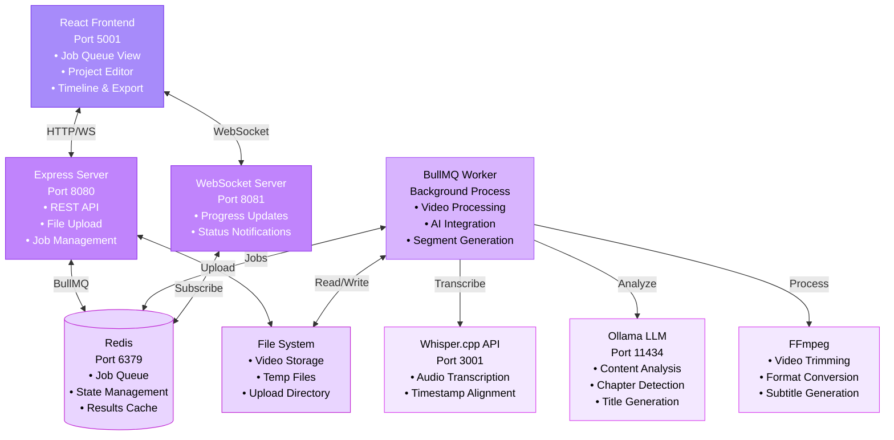

# Splice System Architecture

## Overview

Splice is a local-first video segmentation system that uses AI to automatically analyze and chapter videos. The architecture consists of a React frontend, Express backend, BullMQ job queue, and integration with local AI models (Whisper.cpp and Ollama).

**Key Design Principles:**
- **Local-First**: All processing happens on the user's machine
- **Real-Time Feedback**: WebSocket updates for job progress
- **Asynchronous Processing**: BullMQ handles video processing jobs
- **Modular Design**: Separate concerns across frontend, backend, and workers

## Architecture Diagram



## System Components

### Frontend (React + TypeScript)

**Port:** 5001  
**Key Files:** `src/components/`, `src/services/`

**Responsibilities:**
- User interface for video upload and management
- Real-time job queue visualization with status tracking
- Interactive timeline editor for segment adjustment
- Export view with download progress tracking
- Settings management (LLM model, custom prompts)

**Key Features:**
- Drag-and-drop video upload
- WebSocket-based real-time updates
- LocalStorage settings persistence
- Purple-themed UI with dark mode support

### Backend API Server (Express)

**Port:** 8080  
**Key Files:** `server/src/app.ts`, `server/src/services/`

**Responsibilities:**
- REST API for job management
- File upload handling (multipart/form-data)
- BullMQ job creation and management
- Video segment trimming with FFmpeg
- VTT subtitle generation
- CORS configuration for downloads

**Key Endpoints:**
- `POST /api/upload` - Upload video and create job
- `GET /api/jobs` - List all jobs
- `GET /api/jobs/:id` - Get job details
- `DELETE /api/jobs/:id` - Delete job
- `GET /api/segment/:jobId/:segmentId` - Download trimmed segment
- `GET /api/segment/:jobId/:segmentId/vtt` - Download VTT subtitles
- `GET /api/stats` - Queue statistics
- `POST /api/llm/generate` - LLM proxy endpoint for frontend (calls local Ollama)

### WebSocket Server

**Port:** 8081  
**Key Files:** `server/src/services/websocketService.ts`

**Responsibilities:**
- Real-time job progress updates
- Status change notifications
- Error broadcasting

**Events:**
- `jobUpdate` - Progress and status changes
- `jobCompleted` - Processing completion
- `jobFailed` - Error notifications

### BullMQ Worker

**Key Files:** `server/src/workers/videoProcessor.ts`

**Responsibilities:**
- Asynchronous video processing
- AI integration (Whisper, Ollama)
- Progress tracking and reporting
- Error handling and retry logic

**Processing Pipeline:**
1. **Initialize** (0-10%): Validate video file
2. **Transcribe** (10-60%): Whisper.cpp speech-to-text
3. **Analyze** (60-90%): Ollama LLM content analysis
4. **Finalize** (90-100%): Generate segments, save results

### Redis Queue

**Port:** 6379

**Responsibilities:**
- Job queue management
- Job state persistence
- Result caching
- Worker coordination

### Whisper.cpp API

**Port:** 3001  
**Key Files:** `whisper-server.mjs`

**Responsibilities:**
- Audio-to-text transcription
- Word-level timestamp generation
- GPU-accelerated inference

**Output Format:**
```json
{
  "text": "Full transcript...",
  "segments": [
    {
      "start": 0.0,
      "end": 2.5,
      "text": "Segment text"
    }
  ],
  "duration": 154.0
}
```

### Ollama LLM

**Port:** 11434  
**Models:** Qwen2.5:7b (default), Mistral:7b

**Responsibilities:**
- Content analysis and understanding
- Logical chapter detection
- Segment title and description generation
- Custom instruction processing

**Input:** Transcript + whisper segments + duration + custom prompt  
**Output:** Array of segments with titles, descriptions, and timestamps

**Access Pattern:**
- **Worker (Initial Processing)**: Direct local access to Ollama
- **Frontend (Re-Generate Segments)**: Via backend proxy at `/api/llm/generate`
  - Frontend cannot directly access `localhost:11434` when running on remote machines
  - Backend proxies LLM requests to local Ollama instance
  - Enables "Re-Generate Segments" feature to work over network

### FFmpeg

**Usage:** Command-line spawned process

**Responsibilities:**
- Video trimming for segment export
- Format conversion
- Subtitle file support

## Data Flow

### 1. Video Upload → Processing

```
┌─────────┐     ┌─────────┐     ┌──────────┐     ┌────────┐
│ Browser │────>│ Express │────>│  BullMQ  │────>│ Worker │
└─────────┘     └─────────┘     └──────────┘     └────────┘
                     │                                 │
                     v                                 v
              ┌──────────┐                      ┌──────────┐
              │   File   │                      │  Whisper │
              │  System  │                      │  Ollama  │
              └──────────┘                      └──────────┘
```

**Steps:**
1. User uploads video via drag-and-drop
2. Express saves file to `/uploads` directory
3. BullMQ job created with video metadata
4. Worker picks up job from queue
5. Worker processes video through AI pipeline
6. Results saved to job.returnvalue
7. WebSocket notifies frontend of completion

### 2. Real-Time Updates

```
┌────────┐     ┌───────────┐     ┌─────────┐
│ Worker │────>│ WebSocket │────>│ Browser │
└────────┘     └───────────┘     └─────────┘
     │               │                  │
     v               v                  v
┌─────────┐   ┌──────────┐      ┌──────────┐
│  Redis  │   │   WS     │      │  React   │
│  Queue  │   │  Server  │      │  State   │
└─────────┘   └──────────┘      └──────────┘
```

**Update Types:**
- **Progress**: 0% → 10% → 60% → 90% → 100%
- **Status**: queued → processing → analyzing → completed/failed
- **Messages**: "Transcribing audio...", "LLM analyzing content..."

### 3. Segment Export

```
┌─────────┐     ┌─────────┐     ┌────────┐
│ Browser │────>│ Express │────>│ FFmpeg │
└─────────┘     └─────────┘     └────────┘
     │               │                │
     v               v                v
┌──────────┐   ┌──────────┐    ┌──────────┐
│ Progress │   │   VTT    │    │ Trimmed  │
│   Bar    │   │Generator │    │   Video  │
└──────────┘   └──────────┘    └──────────┘
```

**Steps:**
1. User clicks download button
2. Frontend requests segment with start/end times
3. Express spawns FFmpeg process for trimming
4. Video streams back to browser with progress tracking
5. VTT subtitle file generated from whisper segments
6. Both files download sequentially

### 4. Re-Generate Segments (LLM Proxy)

```
┌─────────┐     ┌─────────┐     ┌────────┐
│ Browser │────>│ Express │────>│ Ollama │
│         │     │  /api/  │     │  LLM   │
│         │     │   llm/  │     │        │
└─────────┘     │generate │     └────────┘
     ^          └─────────┘          │
     │               │               │
     └───────────────┴───────────────┘
          New Segments JSON
```

**Why Proxy?**
- Frontend runs on user's browser (potentially remote machine)
- Ollama only listens on `localhost:11434` on the server
- Browser cannot access server's localhost directly
- Backend proxy bridges the gap

**Flow:**
1. User clicks "Re-Generate Segments" in Project View
2. Frontend sends transcript + settings to `/api/llm/generate`
3. Backend forwards request to local Ollama instance
4. Ollama analyzes content and returns segment suggestions
5. Backend passes response back to frontend
6. Frontend updates project with new segments

## File Structure

```
splice/
├── src/                          # Frontend React app
│   ├── components/
│   │   ├── BullMQQueue.tsx       # Job queue view
│   │   ├── ProjectView.tsx       # Segment editor
│   │   ├── Timeline.tsx          # Interactive timeline
│   │   ├── ExportView.tsx        # Download interface
│   │   └── ui/                   # shadcn/ui components
│   ├── services/
│   │   └── queueAPI.ts           # Backend API client
│   └── hooks/
│       └── useLocalStorage.ts    # Settings persistence
│
├── server/                       # Backend Express app
│   ├── src/
│   │   ├── app.ts                # Main server + routes
│   │   ├── services/
│   │   │   ├── queueService.ts   # BullMQ integration
│   │   │   └── websocketService.ts # WebSocket server
│   │   └── workers/
│   │       └── videoProcessor.ts # Job processing logic
│   └── uploads/                  # Temporary video storage
│
├── shared/                       # Shared utilities
│   └── llmSegmentation.ts        # Ollama integration
│
└── whisper-server.mjs            # Whisper.cpp API server
```

## Technology Decisions

### Why Local-First?
- **Privacy**: Videos never leave user's computer
- **Cost**: No API subscription fees
- **Performance**: GPU acceleration with local models
- **Offline**: Works without internet connection

### Why BullMQ?
- **Reliability**: Job persistence and retry logic
- **Scalability**: Can handle multiple concurrent jobs (limited to 1 for GPU protection)
- **Monitoring**: Built-in queue statistics and job tracking
- **Flexibility**: Easy to add new job types or processing steps

### Why WebSockets?
- **Real-Time**: Instant progress updates without polling
- **Efficiency**: Lower bandwidth than HTTP polling
- **User Experience**: Smooth progress animations and status changes

### Why React + TypeScript?
- **Type Safety**: Catch errors at compile time
- **Developer Experience**: Excellent tooling and debugging
- **Ecosystem**: Rich component library (shadcn/ui)
- **Performance**: Fast rendering with React 19

## Security Considerations

See [SECURITY.md](./SECURITY.md) for detailed security practices.

**Key Points:**
- No authentication (local-only application)
- File type validation on upload
- CORS restricted to localhost
- No sensitive data storage
- Temporary file cleanup

## Performance Optimizations

### Frontend
- Lazy loading for large video files
- Debounced timeline updates
- Virtual scrolling for large job lists (future)
- LocalStorage for settings (avoid API calls)

### Backend
- Streaming video downloads for large files
- FFmpeg streaming output (no temp files)
- Redis for fast job lookups
- Connection pooling for Redis

### Worker
- Single concurrency to protect GPU
- Progress batching (update every 10%)
- Automatic cleanup of processed files
- Memory-efficient streaming

## Deployment Considerations

### Development
```bash
# Start all services
./start-all.sh

# Or manually:
redis-server &
ollama serve &
node whisper-server.mjs &
cd server && npm run dev &
npm run dev
```

### Production (Future)
- Docker containers for each service
- Nginx reverse proxy
- Process manager (PM2)
- Log aggregation
- Health monitoring

## Future Improvements

- [ ] Automated testing (unit, integration, E2E)
- [ ] Docker compose setup
- [ ] Batch processing for multiple videos
- [ ] Video preview in timeline
- [ ] Segment merging functionality
- [ ] Export quality presets
- [ ] Undo/redo for timeline edits
- [ ] Keyboard shortcuts documentation
- [ ] Performance metrics dashboard
Job Completion → API Polling → Result Display → Project Creation → Segment Editor
```

**Complete Flow:**

#### Job Completion Detection
1. **Worker Completion**: Worker stores complete results in `job.returnvalue` including:
   - Full transcript (2638 characters for sample video)
   - 7 intelligent segments with titles, descriptions, and precise timing
   - Video duration and metadata
   - LLM reasoning for segmentation decisions

2. **API Polling**: Frontend continuously polls `/api/jobs` endpoint
3. **Status Detection**: Frontend detects `finishedOn` timestamp and `returnvalue` presence
4. **UI Update**: "View Results" button appears with working functionality

